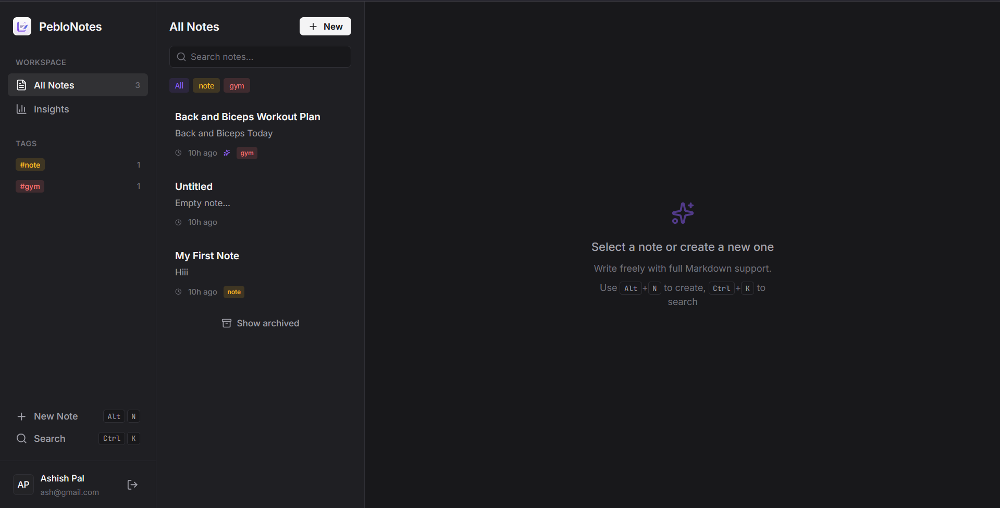
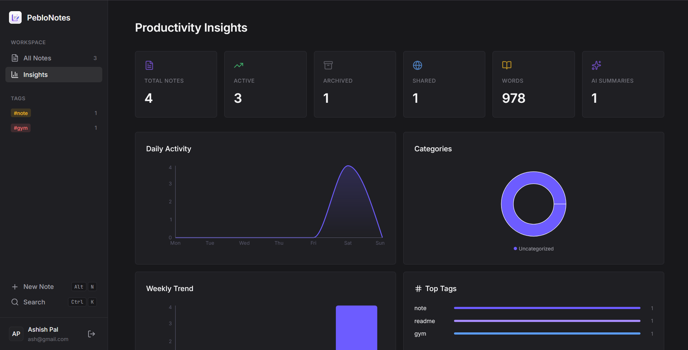

# PebloNotes -- AI-Powered Notes Workspace

A premium, full-stack notes workspace with AI-powered summaries, action item extraction, and smart search -- built for the Peblo Full Stack Developer Challenge.

Think Evernote meets AI: three-panel workspace, markdown support, keyboard-first UX, and Cerebras Llama 3.1-8B for instant AI analysis.

---

## Submission Assets Provided by Candidate

- **Demo Video:** [Watch on YouTube](https://youtu.be/C0KbjGEvhhU?si=aO8sb1S9VDL8V7EK)
- **Live Deployment:** [View Live App](https://peblo-notes-swart.vercel.app/)

---

## What Makes This Stand Out

| Feature | Implementation |
|---|---|
| Three-panel workspace | Sidebar -> Note List -> Editor (like Evernote/Amplenote) |
| Markdown preview | Toggle between edit and rendered markdown view |
| Keyboard-first UX | Ctrl+K search, Alt+N new note, Ctrl+S save |
| AI that is meaningful | Summaries, action items, title suggestions -- persisted per note |
| Auto-save | Debounced (1.2s) with visual save indicator |
| Command palette | Spotlight-style search with keyboard nav |
| Premium dark UI | Custom design system, micro-animations, glassmorphism |
| Production DevOps | Docker multi-stage builds + GitHub Actions CI |

---

## Architecture

```
+----------+---------------+---------------------------------+
| Sidebar  |  Notes List   |        Note Editor              |
|  (240px) |   (320px)     |        (flex-1)                 |
|          |               |                                 |
| Brand    | Search        |  Title input                    |
| Nav      | Tag filters   |  Meta bar (words, date)         |
| Tags     | Note cards    |  Tag editor                     |
| Actions  |               |  Content (edit/preview toggle)  |
| User     |               |  AI Panel (slide-in drawer)     |
+----------+---------------+---------------------------------+
         | REST API (JSON over HTTP)
+------------------------------------------------------------+
|              FastAPI Backend (Uvicorn)                     |
|  auth | notes | ai | share | insights -- 5 routers         |
|  Cerebras Llama 3.1-8B (OpenAI-compatible client)          |
+--------------------+---------------------------------------+
                     |
+--------------------+---------------------------------------+
|           Supabase (PostgreSQL 15 + RLS)                   |
|  users | notes (GIN indexes) | ai_usage_logs               |
+------------------------------------------------------------+
```

### API Endpoints

| Method | Endpoint | Auth Required | Description |
|--------|----------|---------------|-------------|
| POST | `/auth/signup` | No | Register new user |
| POST | `/auth/login` | No | Authenticate user |
| GET | `/auth/me` | Yes | Get user profile |
| GET | `/notes` | Yes | List notes (search, filter, sort, paginate) |
| POST | `/notes` | Yes | Create note |
| GET | `/notes/:id` | Yes | Get single note |
| PATCH | `/notes/:id` | Yes | Update note (auto-save) |
| DELETE | `/notes/:id` | Yes | Delete note |
| POST | `/notes/:id/share` | Yes | Toggle public sharing |
| GET | `/notes/tags/all` | Yes | Get all user tags with counts |
| POST | `/ai/generate-summary` | Yes | Generate AI analysis |
| GET | `/ai/usage` | Yes | AI usage statistics |
| GET | `/shared/:shareId` | No | View shared note (public) |
| GET | `/insights` | Yes | Dashboard analytics |

---

## Setup Instructions

### 1. Configure Environment Variables
See the `.env.example` file in the root directory for all required keys. You will need:
- Supabase account (free tier) for the database URL and keys.
- Cerebras API key (free tier) for the AI model.

### 1. Database Setup
Create a Supabase project -> SQL Editor -> paste `backend/schema.sql` -> Run.

### 3. Install Backend Dependencies & Run
```bash
cd backend
python -m venv venv && source venv/bin/activate  # Windows: venv\Scripts\activate
pip install -r requirements.txt
cp ../.env.example .env  # Fill in your keys
uvicorn app.main:app --reload --port 8000
```

### 4. Install Frontend Dependencies & Run
```bash
cd frontend
npm install
cp ../.env.example .env  # Optional: fill in keys if testing locally
npm run dev    # -> http://localhost:5173
```

### Docker Setup
```bash
docker compose up --build
# Backend -> :8000  |  Frontend -> :3000
```

---

## Testing
```bash
cd backend && python -m pytest tests/ -v
# 17 tests -- auth, JWT, schema validation
```

---

## Structure
```
PebloNotes/
|-- backend/
|   |-- app/
|   |   |-- core/        # Config, JWT security, Supabase client
|   |   |-- routers/     # auth, notes, ai, share, insights
|   |   |-- schemas/     # Pydantic v2 request/response models
|   |   |-- services/    # Cerebras AI service
|   |   +-- main.py      # FastAPI entry point
|   |-- tests/           # Pytest suite
|   |-- schema.sql       # PostgreSQL schema with RLS + indexes
|   +-- Dockerfile       # Multi-stage production build
|-- frontend/
|   |-- src/
|   |   |-- api/         # Typed HTTP client with JWT injection
|   |   |-- components/  # Layout, SearchModal
|   |   |-- contexts/    # Auth state management
|   |   |-- hooks/       # useDebounce, useKeyboardShortcuts
|   |   |-- pages/       # Workspace, Insights, SharedNote, Auth
|   |   +-- index.css    # Premium design system
|   +-- Dockerfile       # Multi-stage with nginx
|-- .github/workflows/   # CI pipeline
|-- docker-compose.yml
+-- .env.example
```

---

## Design Decisions

1. **Three-panel layout** -- Notes list and editor coexist (no page navigation), matching how professionals actually use note apps (Evernote, Amplenote, Notion).
2. **Cerebras Llama 3.1-8B** -- Sub-second AI responses via OpenAI-compatible API, demonstrating practical AI integration (not just a gimmick).
3. **Custom JWT auth** -- Full control over auth flow, demonstrates backend engineering beyond BaaS reliance.
4. **Debounced auto-save** -- 1.2s debounce prevents API spam while ensuring data safety.
5. **GIN indexes** -- PostgreSQL array and full-text search indexes for performant tag/content search at scale.
6. **Modular routers** -- Each domain (auth, notes, AI, share, insights) isolated for maintainability.

---

## Sample Outputs

### Application Screenshots
*(Add your screenshots to an `assets/` folder and link them here, or drag and drop images directly into GitHub to auto-generate the markdown)*

```markdown
<!-- Example of how to link your screenshots once you have them -->


```

### AI-Generated Summary & Action Items
*(Example response from `/ai/generate-summary`)*
```json
{
  "summary": "Sprint planning discussion covering UI mockup deadlines, API restructuring, and Q2 deployment timeline.",
  "action_items": [
    "Prepare UI mockups by Wednesday",
    "Review API structure",
    "Set up staging pipeline"
  ],
  "suggested_title": "Sprint Planning -- Q2 Release Prep",
  "tokens_used": 245
}
```

### Insights Response
```json
{
  "overview": {
    "total_notes": 24,
    "active_notes": 20,
    "archived_notes": 4,
    "shared_notes": 3,
    "total_words": 12847
  },
  "top_tags": [
    { "name": "work", "count": 12 },
    { "name": "ideas", "count": 8 }
  ],
  "ai_usage": {
    "total_summaries": 15,
    "total_tokens": 3670
  }
}
```

### Database Schema (Abridged)
```sql
CREATE TABLE users (
    id UUID PRIMARY KEY DEFAULT gen_random_uuid(),
    name TEXT NOT NULL,
    email TEXT UNIQUE NOT NULL,
    password_hash TEXT NOT NULL,
    created_at TIMESTAMPTZ DEFAULT now()
);

CREATE TABLE notes (
    id UUID PRIMARY KEY DEFAULT gen_random_uuid(),
    user_id UUID NOT NULL REFERENCES users(id) ON DELETE CASCADE,
    title TEXT DEFAULT 'Untitled',
    content TEXT DEFAULT '',
    tags TEXT[] DEFAULT '{}',
    is_archived BOOLEAN DEFAULT FALSE,
    is_public BOOLEAN DEFAULT FALSE,
    ai_summary TEXT,
    ai_action_items TEXT[],
    updated_at TIMESTAMPTZ DEFAULT now()
);

CREATE TABLE ai_usage_logs (
    id UUID PRIMARY KEY DEFAULT gen_random_uuid(),
    user_id UUID NOT NULL REFERENCES users(id) ON DELETE CASCADE,
    tokens_used INTEGER DEFAULT 0,
    operation TEXT DEFAULT 'generate_summary'
);

-- RLS Policies ensure users can only access their own notes
ALTER TABLE notes ENABLE ROW LEVEL SECURITY;
CREATE POLICY "Users can manage own notes" ON notes FOR ALL USING (auth.uid() = user_id);
```
